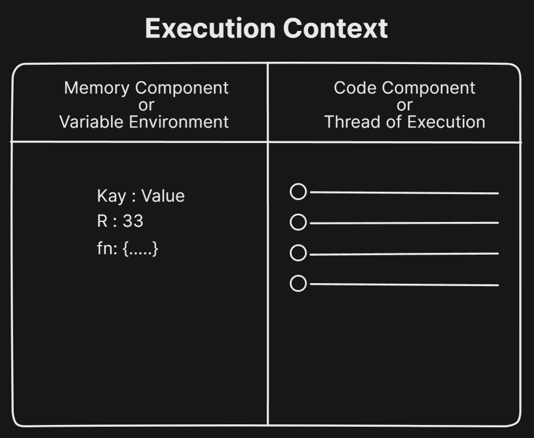
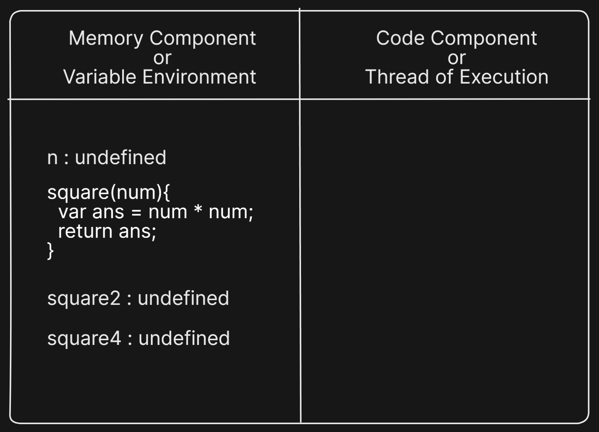
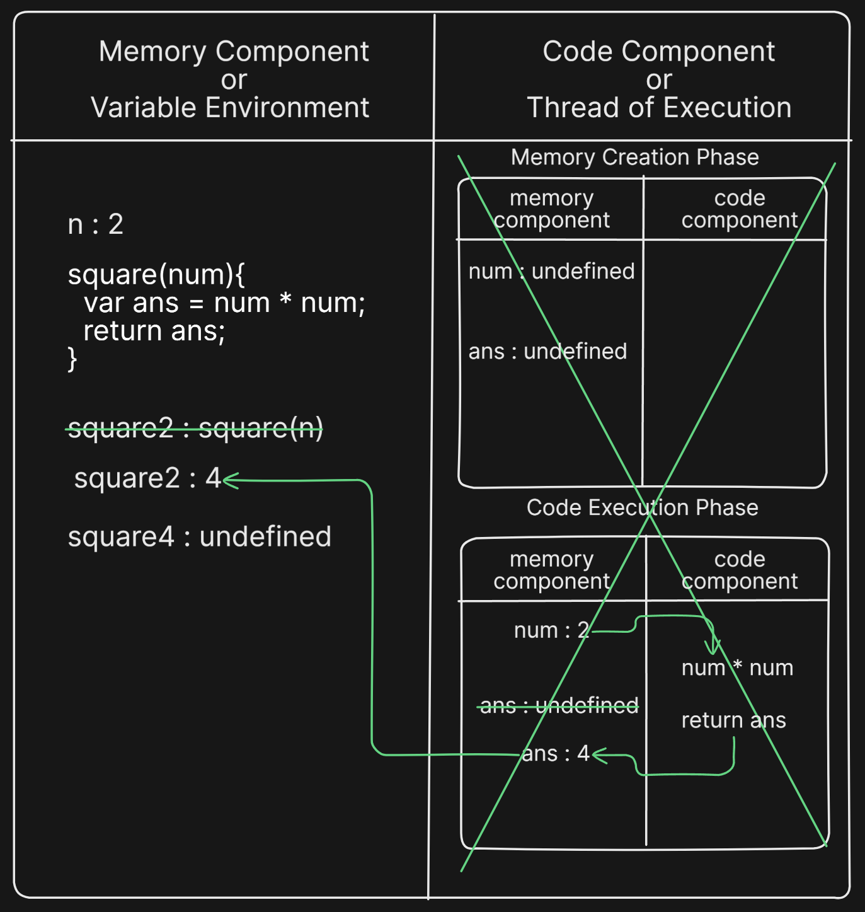
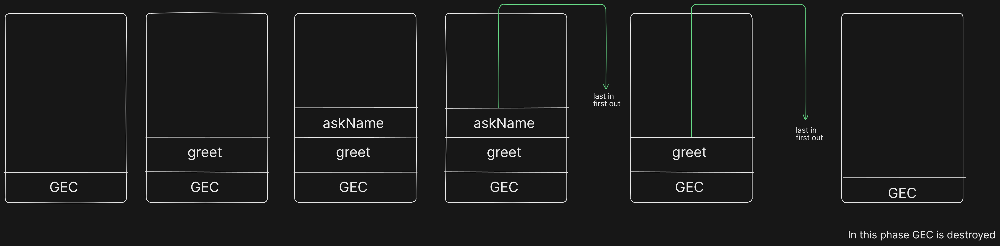

# Execution Context and Call Stack

JavaScript is a synchronous, single-threaded language

- **Synchronous**: It executes line by line, one task at a time.
- **Single-threaded**: It can only execute one task at a time because it has only one thread of execution
- It proceeds to the next line only when the current line has finished executing.

## Execution Context

Everything in JavaScript is executed in the **Execution Context**.

It consists of two things:

- Memory component - also known as the **Variable Environment**
- Code component - also known as the **Thread of Execution**

In execution context,

- Variables and Functions are stored in memory component
- JavaScript code is executed in code component



## How JavaScript code is executed?

```JS
var n = 2;
function square(num){
  var ans = num * num;
  return ans;
}
var square2 = square(n);
var square4 = square(4);
```

When JavaScript ran first time, a **Global Execution Context** (GEC) is created.

Every execution context has two phases:

- Memory creation
- Code execution

### Memory creation phase

- JavaScript allocates memory to all the variables and functions
- For variables special value undefined is allocated
- For functions, whole function is copied into the memory space



### Code execution phase

- JavaScript code will be executed line by line, one at a time
- Variables created in the Memory Creation Phase receive value as code is executed.
- When the function is invoked, a brand new execution context is created, and it also has its own
  memory and code component
- This newly created execution context also has two phases same as GEC
- Code inside the function is executed on the newly created execution context.
- return statement returns the control to the invoking context.
- This newly created execution context is deleted after function execution is finished



## Call Stack

- Call stack keep track of function calls
- The call stack keeps the order in which functions are called and need to be returned.

### How it works?

- When a function is invoked, it’s pushed onto the top of the stack.
- When the function finishes execution, it's popped off the stack.
- Functions are executed in a **Last In, First Out (LIFO)** order.

```JS
function greet() {
  console.log("Hello!");
  askName();
}

function askName() {
  console.log("What’s your name?");
}

greet();
```


