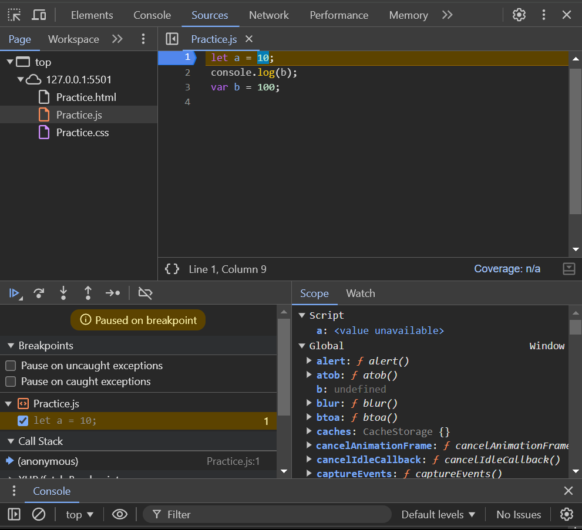

# Functions and Variable Environment

## Function

A function is a reusable block of code that performs a specific task.

Ways to define a function:

- Function Declaration
- Function Expression
- Arrow Function
- IIFE (Immediately Invoked Function Expression)

### Function Declaration/Statement

- Function declaration is “hoisted,” meaning you can call it before it’s defined in the code.
- argument object is available inside the function.
  - `[Arguments] { '0': 'JS', '1': 2025, '2': true }`
- `this`

```JS
function add(a, b) {
  return a + b;
}
console.log(add(2, 3)); // Output: 5
```

### Function Expression

- Not hoisted: Can't be used before assignment
- Behaves like a value (can be passed as arguments)
- You use a variable to store the function expression and it can use `let` or `const`.
- `this`

**Anonymous Function Expression**

```JS
const add = function(a, b) {
  return a + b;
};
console.log(add(2, 3)); // Output: 5
```

**Named Function Expression**

```JS
const multiply = function times(a, b) {
  return a * b;
  // return times(a, b);
};

console.log(multiply(4, 5)); // Output: 20
// console.log(times(4, 5)); // Throws an error: times is not defined (name is local to the function)
```

### Arrow Function

- not hoisted
- No arguments object (use rest parameters instead)
- Implicit return for single expressions
- `this`

```JS
const add = (a, b) => a + b;
console.log(add(2, 3)); // Output: 5
```

### IIFE (Immediately Invoked Function Expression)

- Creates a private scope (pre-module era pattern)
- Avoids polluting global namespace

```JS
(function() {
  console.log("Runs immediately");
})();
```

### First-Class Functions/Citizens

Ability to use functions as values, pass them as arguments and return them from other functions.

- Functions can be assigned to variables
- Functions can be passed as arguments to other functions
- Functions can be returned from other functions

```JS
function c(param) {
  console.log(param);
}

c(d);

function d() {
  console.log("Sent as parameter");
}

function e() {
  return function () {
    console.log("Hello");
  };
}

function f() {
  return function greeting() {
    console.log("Namaste");
  };
}

console.log(e());
console.log(f());
e()();
f()();
```

### Parameters and Arguments

- Parameters are variables listed in the function definition.
- Arguments are actual values passed to the function when it's called.

# Returning Values

Use `return` to send a value back. If omitted, the function returns `undefined`. If we use `console.log()`, `undefined` is printed to the console.

#### Summary

- Use function declarations for general-purpose, reusable functions.
- Use function expressions and arrow functions for callbacks, closures, and when you need lexical this.

## Variable Environment

Variable declared with `var` is attached with `window` in browser. Variable declared with `let` and `const` are not attached to `window` or `global`.

### Scope:

`var`: Function-scoped. Accessible throughout the entire function, even outside the block it’s declared in.

`let` and `const`: Block-scoped. Limited to the block (e.g., {} inside if, for) where they’re declared, even within a function.

### Hoisting:

`var`: Hoisted to the top of the function and initialized with undefined.

`let` and `const`: Hoisted but not initialized (Temporal Dead Zone). Accessing them before declaration causes a `ReferenceError`.



### Redeclaration:

`var`: Can be redeclared in the same scope.

`let` and `const`: Cannot be redeclared in the same scope.

### Reassignment:

`var` and `let`: Can be reassigned.

`const`: Cannot be reassigned after declaration.

## Temporal Dead Zone

- It starts when the current scope started and ends when variable is initialized.
- Time period between variable being hoisted and being initialized called **Temporal Dead Zone**.
- TDZ exists from the start of the scope until the variable is declared and initialized.
- If the variable is in global scope it will be in script memory, and if variable is inside function it will be in lexical environment.

### Why TDZ Exists:

- Avoid Bugs: Prevents using variables before they’re declared.
- Encourage Clarity: Forces developers to declare variables at the top of their scope.

## Difference between ReferenceError vs SyntaxError vs TypeError

### ReferenceError

- Accessing a variable before declaration or initialization
- When a variable and function are not in the current scope
- Error message typically starts with: `ReferenceError: [variable/function] is not defined`

### SyntaxError

- There's a mistake in the code syntax (e.g., missing/extra brackets, parentheses, or semicolons).
- Invalid or unsupported syntax is used.
- A reserved word is used as a variable or function name.
- Error message typically starts with: `SyntaxError: [description of the error]`

### TypeError

- A value is not of the expected type.
- A function is called on a value of the wrong type.
- An attempt is made to access a property or method that doesn't exist.
- Reassigning constant
- Error message typically starts with: `TypeError: [description of the error]`

## Block

- A block is a group of statements that are enclosed by `{` and `}`.

### Why block is used?

- Block is used to group multiple statements together so that they can be used as a single unit.
