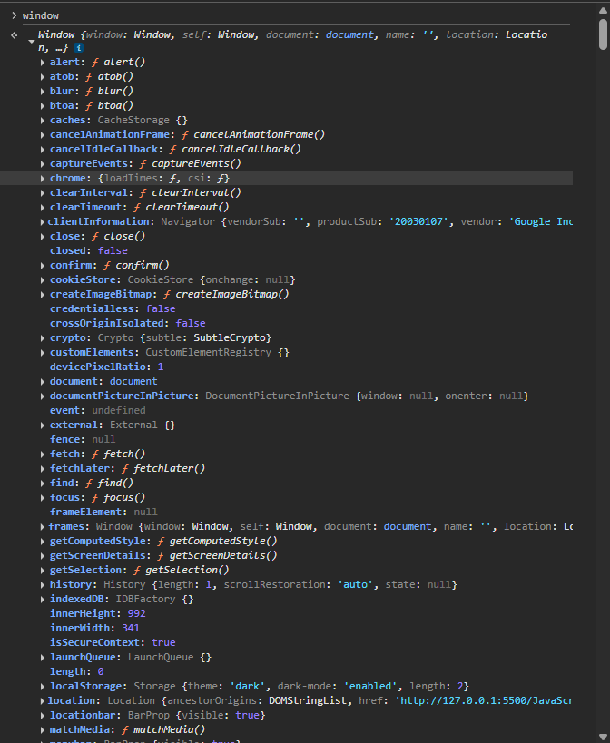

# window

## Shortest JavaScript Program

Shortest JavaScript Program is an empty file. There is nothing to execute, the JavaScript engine does several things behind the scenes.

1. **Global Execution Context (GEC)**

   - **Memory Component** (Variable Environment): Allocates space for all global variables and function declarations.
   - **Code Component** (Thread of Execution): Executes the code line by line.

2. **Global Object Creation**

   The global object is a single entity shared across all execution contexts within the same JavaScript environment (like a browser or Node.js).

- In browsers, the JS engine creates the window object alongside the GEC. It provides built‑in methods like alert(), setTimeout(), and access to the DOM via document.

3. **`this` in Global Scope**

   - In the global execution context (outside of any function) of a browser, `this === window.`

4. **Global Variables as Properties**

   - Variables declared with `var` in the global scope become properties of `window` (e.g., `var a = 10;` ➔ `window.a === 10`).
   - variables declared with `let` or `const` are not added to window

5. **Environment Differences**
   - Browser: Global object is `window`.
   - Node.js: Global object is `global`. unlike browsers, top-level `var` variables in Node.js are not attached to `global`;

## Global Space
