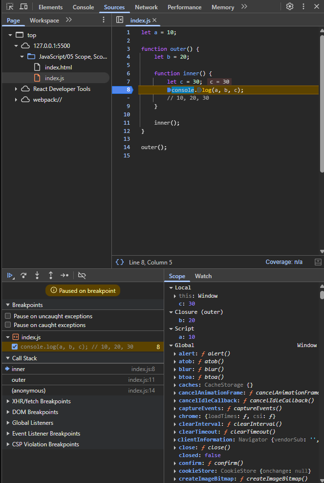

# Scope, Lexical Environment and Scope Chain

## Scope

Scope determines where variables, functions, and objects are accessible in your code.

### Types of Scope

1. Global Scope
2. Function Scope
3. Block Scope (ES6)
4. Lexical Scope
5. Module Scope

#### Global Scope

- Variables declared outside of any function or block ({}) are in global scope.
- It is accessible anywhere in the code.
- Global variables can be modified from any function or block.

```JS
let name = "Subramanyeshwara";

function greet() {
  console.log(name); // ✅ Accessible
}
greet(); // "Subramanyeshwara"
```

#### Function Scope

- Variables declared inside a function are in function scope.
- They are only accessible within the function and can be modified within the function.

```JS
function greet() {
  let name = "Subramanyeshwara";
  console.log(name); // ✅ Accessible
}
greet(); // "Subramanyeshwara"
console.log(name); // ReferenceError: name is not defined
```

#### Block Scope

- Variables declared with `let` or `const` inside a block (e.g., {}, if, for) are in block scope.
- They are only accessible within the block.

```JS
if (true) {
  let status = "active";
  const role = "admin";
  console.log(status, role); // ✅ Accessible here
}

console.log(status); // ReferenceError: status is not defined
console.log(role); // ReferenceError: role is not defined
```

#### Module Scope

- Variables declared inside a module are in module scope.
- They are not globally accessible unless explicitly exported.

```JS
// module.js
const moduleVar = "I'm module-scoped!";
export { moduleVar };
```

```JS
// main.js
import { moduleVar } from './module.js';
console.log(moduleVar); // Accessible: "I'm module-scoped!"
```

## Lexical Environment

- Lexical Environment is a data structure that keep track of variable, functions, and the environment in which they were created
- It keeps the reference to the outer lexical environment (parent scope).
- **Lexical Environment = local memory + outer scope.**
- It consists of two components:
  - **Environment Record**: Contains actual variables and functions(parameters) defined in current scope. Also keep track of `this`, `super`
  - **Outer Lexical Environment Reference** : Link to the outer(parent) lexical environment.

```JS
let a = 10;

function outer() {
  let b = 20;

  function inner() {
    let c = 30;
    console.log(a, b, c); // 10, 20, 30
  }

  inner();
}

outer();
```

**What happens behind the scenes?**

- `inner()` has its own Lexical Environment with `c`.
- `inner()` also has a link to its outer environment `outer()`, where it finds `b`.
- If `inner()` doesn't find `a` in `outer()`, it checks the global environment, and finds `a`.

**Lexical Environment of inner()**

You can see it has its own lexical environment, its outer lexical environment is `outer()` and the global environment.



**Lexical Environment of outer()**


**Lexical Environment of global**


## Scope Chain

The scope chain is the series of lexical environments where each environment has reference to its parents environment, forming a chain.

**When a variable is accessed, the engine checks:**

- The current lexical environment.
- If not found, checks the outer/parent environment.
- Continues until it reaches the global environment (or throws a `ReferenceError`).

```JS
// Global Lexical Environment (outer = null)
const globalVar = "Global";

function outerFunc() {
  // outerFunc's Lexical Environment (outer = global)
  const outerVar = "Outer";

  function innerFunc() {
    // innerFunc's Lexical Environment (outer = outerFunc)
    const innerVar = "Inner";
    console.log(innerVar); // "Inner" (current scope)
    console.log(outerVar); // "Outer" (outerFunc's scope)
    console.log(globalVar); // "Global" (global scope)
  }
  innerFunc();
}
outerFunc();
```
