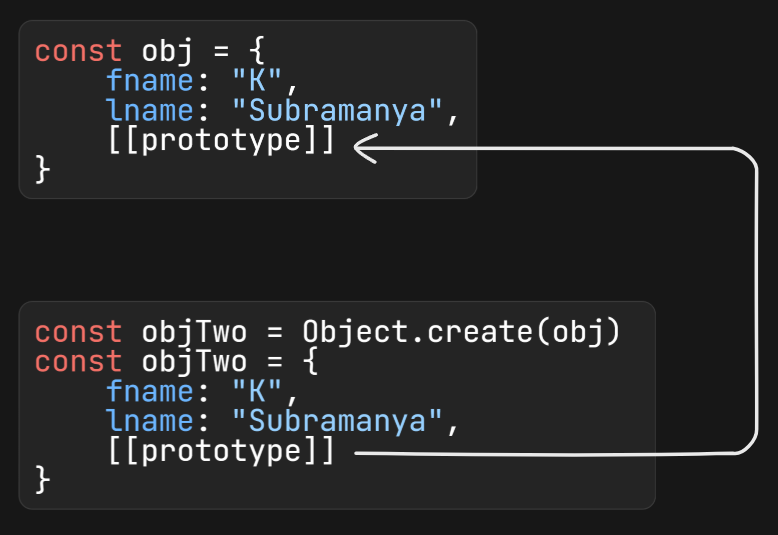

# Prototype, Prototype Chain and Prototype Inheritance

## Prototype

**Prototype** is an object and every object in JavaScript has a `[[prototype]]` by default. This prototype object can itself have a prototype, forming a chain. Prototype is a mechanism that allows sharing of properties and methods between objects.

## How it works?

- When you create an object using the literal syntax (using `const a = {};`), it automatically gets a `[[prototype]]` object. It inherits properties and methods from the `object.prototype`.
- When you create an object using a constructor function (`new`), the `[[prototype]]` property of the object is set to the `[[prototype]]` property of the constructor function.

## [[prototype]]

**[[prototype]]** is an internal property of every object pointing to its prototype object. It is accessed via `__proto__` or `Object.getPrototypeOf()`.



You can check this by exapanding the object in the console and looking for `[[prototype]]`. In that again locate `[[prototype]]` expand it, then locate `__proto__` and expand it. You will see same properties and methods of parent object.

## Prototype Chain

- It is a sequence of prototypes JavaScript travers to find the property or method.
- JavaScript first checks objects itself, then own prototype, then checks the prototype of the prototype and so on until `null` is reached.
- It enables the inheritance and code reusability.

## Prototype Inheritance

- It is used to share properties and methods between objects.
- It is the ability to borrow properties and methods from another object.

## What happens when you create an object?

1. Object Literal Syntax (const a = {};)

   When you create an object using the literal syntax, its `[[prototype]]` points to `Object.prototype`.

   ```JS
   const a = {};
   console.log(a.__proto__ === Object.prototype); // true
   ```

2. Constructor Function (new Constructor())

   When you create an object using constructor function and `new` keyword the `[[prototype]]` of the created object points to the `prototype` property of the constructor function.

   Constructor function prototype itself has a `[[prototype]]` pointing to `Object.prototype`.

   ```JS
   function Person(name) {
   this.name = name;
   }

   const person = new Person("John");
   console.log(person.__proto__ === Person.prototype); // true
   console.log(Object.getPrototypeOf(person) === Person.prototype); // true
   // above two are same Object.getPrototypeOf() is new way and __proto__ is old way
   console.log(Object.getPrototypeOf(Person.prototype) ===  Object.prototype); // true
   ```

3. Using Object.create()

   When you create an object using `Object.create()` it will point to the object you pass as an argument because it sets up the prototype chain and allow to inherit directly from the object you specify.

   ```JS
   const obj = { greet: "Hello" };
   const objTwo = Object.create(obj);

   console.log(Object.getPrototypeOf(objTwo) === obj); // true
   console.log(Object.getPrototypeOf(obj)=== Object.prototype); // true
   ```

4. Class Syntax (new Class())
   When you create an object using a class, its `obj.__proto__` points to the `class.prototype`.

   `class.prototype.__proto__` points to `Object.prototype`

   ```JS
   class Animal {
   constructor(name) {
       this.name = name;
       }
   }

   const dog = new Animal("Rex");
   console.log(dog.__proto__ === Animal.prototype); // true
   console.log(Object.getPrototypeOf(dog) === Animal.prototype); // true
   console.log(Animal.prototype.__proto__ === Object.prototype); // true
   console.log(Object.getPrototypeOf(Animal.__proto__) === Object.prototype); // true
   ```

5. Built-in Objects (e.g., Arrays, Functions)

   for built-in object, thier `obj.__proto__` points to the `Array.prototype` or `Function.prototype`.

   `class.prototype.__proto__` points to `Object.prototype`

## Object.getPrototypeOf()

The `Object.getPrototypeOf()` method returns the prototype(`[[protorype]]`) of the specified object.

```JS
const college = {
  collegeName: "IIIT Bengaluru",
  City: "Bengaluru",
};
console.log(Object.getPrototypeOf(college));
```

## Object.setPrototypeOf()

The `Object.setPrototypeOf()` method sets the prototype(`[[protorype]]`) of the specified object.

```JS
const animal = {
  speak() {
    console.log("Animal speaks");
  },
};

const dog = {
  bark() {
    console.log("Woof!");
  },
};

// Initially, dog has no prototype methods from animal
dog.speak(); // Error: dog.speak is not a function

// Set animal as prototype of dog
Object.setPrototypeOf(dog, animal);

dog.speak(); // Animal speaks
dog.bark();  // Woof!
```

> .prototype is a property of an constructor function. Regular objects don't have this property.

> ✅ [[Prototype]] is present on all objects (including functions), and it forms the inheritance chain (a.k.a. the prototype chain). 

> ✅ .prototype is a property of constructor functions. It is used only when a function is called with new. 
> - It sets the [[Prototype]] of the new object to point to the constructor function’s .prototype. 
> - Allows methods and properties defined on .prototype to be shared across all instances

# Wrapper Classes

Wrapper classes are built-in objects that wrap primitive values to provide methods and properties to manipulate these values.

```JS
string String
number Number
boolean Boolean
symbol Symbol
bigint BigInt
```

## How to check the wrapper class

```JS
let num = 10;
console.log(Object.getPrototypeOf(num))
```
